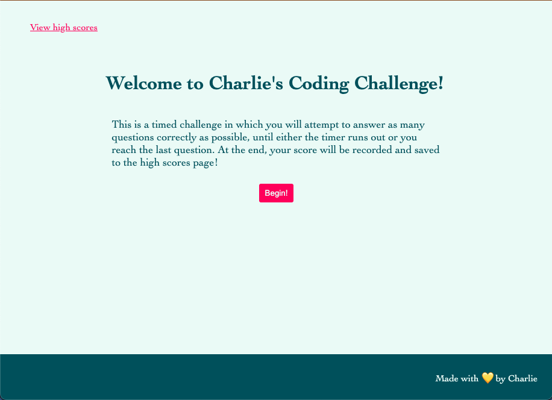
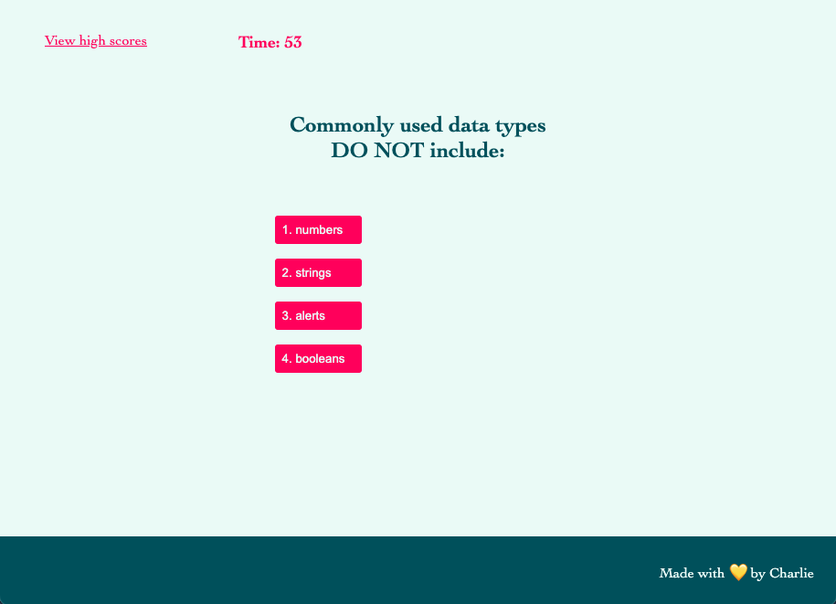
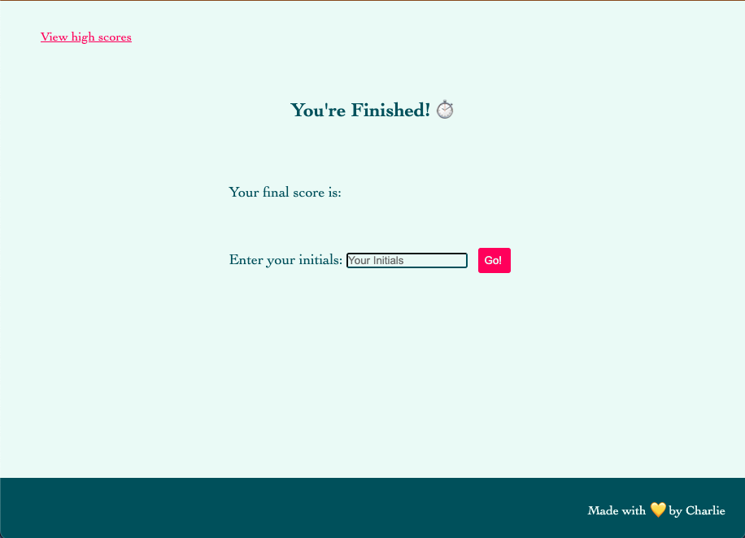
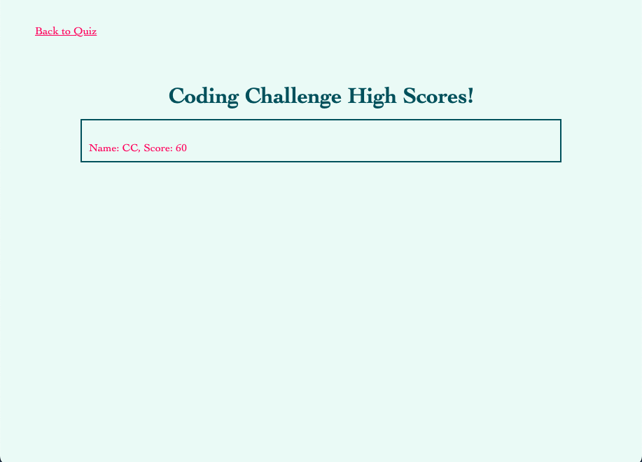

# <Charlies-Code-Quiz>

## Description

Charlie's code quiz is a timed challenge where the user answers a series of coding related questions as quickly as possible. If the timer runs out or they get too many questions wrong, the quiz will end. The user can then submit their initials to view their score on the highscores page.

## Usage

Click the link here to deploy the page:
<!-- Insert Link here before submitting -->

## Page Samples

Welcome Page
 

 
 
 
Question Sample Page
 

 
 
 
You're Finished!
 

 
 
 
High Scores
 

## Credits

Written entirely from scratch, by me, Charlie 💛
 
You can see more of my work on my GitHub:
https://github.com/charliec1665